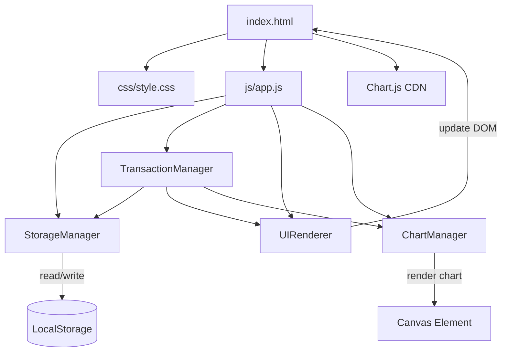
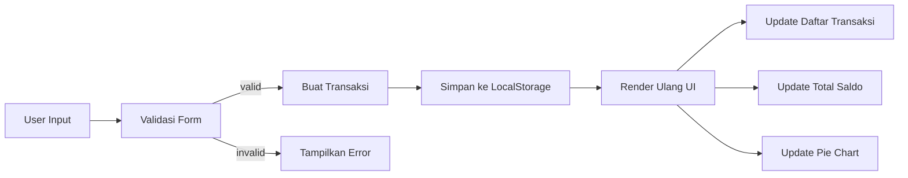
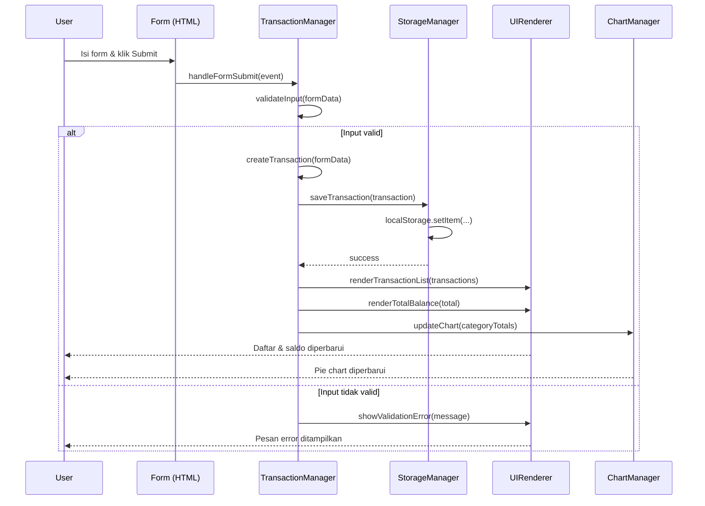
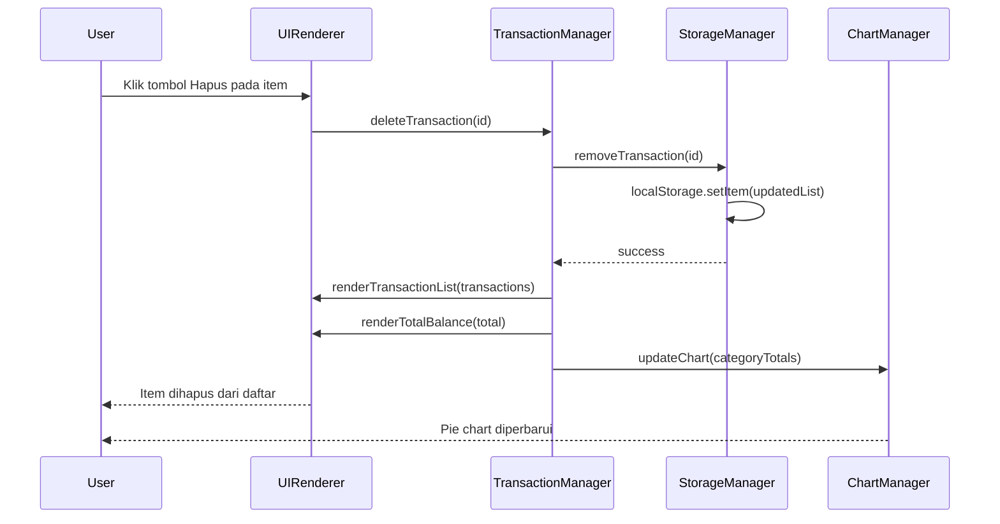
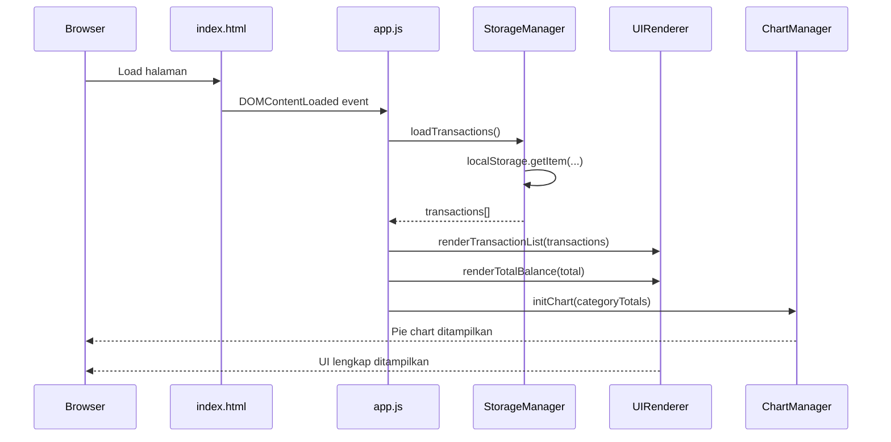

# Design Document: Expense Budget Visualizer

## Overview

Aplikasi Visualisasi Pengeluaran & Anggaran adalah aplikasi web berbasis client-side yang memungkinkan pengguna mencatat, mengelola, dan memvisualisasikan pengeluaran harian mereka. Aplikasi ini dibangun menggunakan HTML, CSS, dan JavaScript murni tanpa framework atau backend, dengan data yang disimpan sepenuhnya di Local Storage browser.

Fitur utama mencakup form input transaksi, daftar transaksi yang dapat di-scroll dan dihapus, tampilan total saldo yang diperbarui secara otomatis, serta pie chart interaktif yang menampilkan distribusi pengeluaran per kategori menggunakan Chart.js.

Desain mengutamakan kesederhanaan dan performa — tidak ada setup rumit, tidak ada server, dan semua interaksi UI bersifat responsif dan instan.

## Architecture

Aplikasi ini menggunakan arsitektur **Single-Page Application (SPA) berbasis vanilla JavaScript** dengan pola **MVC sederhana** (Model-View-Controller) yang diimplementasikan dalam satu file JavaScript.



### Struktur File

```
expense-budget-visualizer/
├── index.html          ← Entry point, struktur HTML
├── css/
│   └── style.css       ← Satu file CSS untuk semua styling
└── js/
    └── app.js          ← Satu file JS untuk semua logika
```

### Alur Data



## Sequence Diagrams

### Alur Tambah Transaksi



### Alur Hapus Transaksi



### Alur Inisialisasi Aplikasi



## Components and Interfaces

### Component 1: StorageManager

**Purpose**: Mengelola semua operasi baca/tulis ke LocalStorage browser.

**Interface**:
```javascript
const StorageManager = {
  // Mengambil semua transaksi dari LocalStorage
  loadTransactions() { /* returns Transaction[] */ },

  // Menyimpan array transaksi ke LocalStorage
  saveTransactions(transactions) { /* returns void */ },

  // Menambah satu transaksi baru
  addTransaction(transaction) { /* returns void */ },

  // Menghapus transaksi berdasarkan ID
  removeTransaction(id) { /* returns void */ }
}
```

**Responsibilities**:
- Serialisasi dan deserialisasi data JSON ke/dari LocalStorage
- Menangani kasus LocalStorage kosong (return array kosong)
- Menjaga konsistensi data saat operasi baca/tulis

---

### Component 2: TransactionManager

**Purpose**: Mengelola logika bisnis — validasi, pembuatan, dan penghapusan transaksi.

**Interface**:
```javascript
const TransactionManager = {
  // Memvalidasi data form sebelum disimpan
  validateInput(name, amount, category) { /* returns { valid: boolean, message: string } */ },

  // Membuat objek transaksi baru dengan ID unik
  createTransaction(name, amount, category) { /* returns Transaction */ },

  // Menghitung total semua pengeluaran
  calculateTotal(transactions) { /* returns number */ },

  // Mengelompokkan total per kategori untuk chart
  getCategoryTotals(transactions) { /* returns { [category: string]: number } */ },

  // Handler untuk submit form
  handleFormSubmit(event) { /* returns void */ },

  // Handler untuk hapus transaksi
  handleDelete(id) { /* returns void */ }
}
```

**Responsibilities**:
- Validasi semua field form (tidak boleh kosong, amount harus angka positif)
- Membuat ID unik untuk setiap transaksi
- Menghitung total saldo dan distribusi per kategori
- Mengkoordinasikan StorageManager, UIRenderer, dan ChartManager

---

### Component 3: UIRenderer

**Purpose**: Mengelola semua manipulasi DOM dan rendering tampilan.

**Interface**:
```javascript
const UIRenderer = {
  // Merender ulang seluruh daftar transaksi
  renderTransactionList(transactions) { /* returns void */ },

  // Memperbarui tampilan total saldo
  renderTotalBalance(total) { /* returns void */ },

  // Menampilkan pesan error validasi
  showValidationError(message) { /* returns void */ },

  // Menyembunyikan pesan error
  hideValidationError() { /* returns void */ },

  // Membersihkan form setelah submit berhasil
  clearForm() { /* returns void */ },

  // Membuat elemen HTML untuk satu item transaksi
  createTransactionElement(transaction) { /* returns HTMLElement */ }
}
```

**Responsibilities**:
- Merender daftar transaksi ke DOM
- Memperbarui tampilan total saldo secara real-time
- Menampilkan dan menyembunyikan pesan error validasi
- Membersihkan form setelah submit berhasil

---

### Component 4: ChartManager

**Purpose**: Mengelola inisialisasi dan pembaruan pie chart menggunakan Chart.js.

**Interface**:
```javascript
const ChartManager = {
  // Menginisialisasi pie chart pertama kali
  initChart(categoryTotals) { /* returns void */ },

  // Memperbarui data chart tanpa re-render penuh
  updateChart(categoryTotals) { /* returns void */ },

  // Menghasilkan warna untuk setiap kategori
  getCategoryColors(categories) { /* returns string[] */ }
}
```

**Responsibilities**:
- Inisialisasi instance Chart.js pada canvas element
- Memperbarui data chart saat transaksi berubah
- Mengelola warna konsisten per kategori
- Menangani kasus data kosong (tampilkan placeholder)

## Data Models

### Model 1: Transaction

```javascript
// Objek transaksi yang disimpan di LocalStorage
const Transaction = {
  id: String,        // ID unik, format: "txn_" + Date.now() + random
  name: String,      // Nama item pengeluaran, tidak boleh kosong
  amount: Number,    // Jumlah pengeluaran, harus > 0
  category: String,  // Salah satu dari: "Makanan", "Transportasi", "Hiburan"
  createdAt: String  // ISO timestamp saat transaksi dibuat
}
```

**Validation Rules**:
- `name`: string tidak kosong, panjang 1–100 karakter
- `amount`: angka positif, lebih dari 0, maksimum 2 desimal
- `category`: harus salah satu dari nilai enum yang valid
- `id`: di-generate otomatis, tidak boleh duplikat
- `createdAt`: di-generate otomatis saat pembuatan

---

### Model 2: CategoryTotals

```javascript
// Agregasi total pengeluaran per kategori untuk chart
const CategoryTotals = {
  "Makanan": Number,       // Total pengeluaran kategori Makanan
  "Transportasi": Number,  // Total pengeluaran kategori Transportasi
  "Hiburan": Number        // Total pengeluaran kategori Hiburan
}
```

**Validation Rules**:
- Setiap nilai adalah angka non-negatif
- Kategori yang tidak memiliki transaksi tidak perlu disertakan (atau bernilai 0)

---

### Model 3: ValidationResult

```javascript
// Hasil validasi form input
const ValidationResult = {
  valid: Boolean,   // true jika semua field valid
  message: String   // Pesan error jika valid = false, kosong jika valid = true
}
```

## Algorithmic Pseudocode

### Algoritma Utama: handleFormSubmit

```javascript
ALGORITHM handleFormSubmit(event)
INPUT: event (DOM submit event)
OUTPUT: void (side effects: update storage, DOM, chart)

BEGIN
  event.preventDefault()

  name     ← document.getElementById("item-name").value.trim()
  amount   ← parseFloat(document.getElementById("amount").value)
  category ← document.getElementById("category").value

  result ← validateInput(name, amount, category)

  IF result.valid = false THEN
    showValidationError(result.message)
    RETURN
  END IF

  hideValidationError()

  transaction ← createTransaction(name, amount, category)

  StorageManager.addTransaction(transaction)

  transactions   ← StorageManager.loadTransactions()
  total          ← calculateTotal(transactions)
  categoryTotals ← getCategoryTotals(transactions)

  UIRenderer.renderTransactionList(transactions)
  UIRenderer.renderTotalBalance(total)
  ChartManager.updateChart(categoryTotals)

  UIRenderer.clearForm()
END
```

**Preconditions:**
- DOM sudah ter-load sepenuhnya
- LocalStorage tersedia di browser
- Chart.js sudah diinisialisasi

**Postconditions:**
- Jika valid: transaksi baru tersimpan, UI dan chart diperbarui, form dikosongkan
- Jika tidak valid: pesan error ditampilkan, tidak ada perubahan data

---

### Algoritma: validateInput

```javascript
ALGORITHM validateInput(name, amount, category)
INPUT: name (string), amount (number), category (string)
OUTPUT: ValidationResult { valid: boolean, message: string }

BEGIN
  IF name = "" OR name = null OR name = undefined THEN
    RETURN { valid: false, message: "Nama item tidak boleh kosong" }
  END IF

  IF name.length > 100 THEN
    RETURN { valid: false, message: "Nama item maksimal 100 karakter" }
  END IF

  IF isNaN(amount) OR amount <= 0 THEN
    RETURN { valid: false, message: "Jumlah harus berupa angka positif" }
  END IF

  validCategories ← ["Makanan", "Transportasi", "Hiburan"]

  IF category NOT IN validCategories THEN
    RETURN { valid: false, message: "Pilih kategori yang valid" }
  END IF

  RETURN { valid: true, message: "" }
END
```

**Preconditions:**
- Parameter `name`, `amount`, `category` diberikan (boleh null/undefined)

**Postconditions:**
- Selalu mengembalikan ValidationResult
- `valid = true` jika dan hanya jika semua kondisi terpenuhi
- `message` berisi deskripsi error pertama yang ditemukan jika `valid = false`
- Tidak ada side effects pada parameter input

---

### Algoritma: getCategoryTotals

```javascript
ALGORITHM getCategoryTotals(transactions)
INPUT: transactions (Transaction[])
OUTPUT: CategoryTotals { [category: string]: number }

BEGIN
  totals ← {}

  FOR each transaction IN transactions DO
    // Loop Invariant: totals berisi akumulasi yang benar untuk semua transaksi yang sudah diproses
    IF totals[transaction.category] = undefined THEN
      totals[transaction.category] ← 0
    END IF
    totals[transaction.category] ← totals[transaction.category] + transaction.amount
  END FOR

  RETURN totals
END
```

**Preconditions:**
- `transactions` adalah array (boleh kosong)
- Setiap transaksi memiliki `category` (string) dan `amount` (number positif)

**Postconditions:**
- Mengembalikan objek dengan total per kategori
- Jika `transactions` kosong, mengembalikan objek kosong `{}`
- Setiap nilai dalam hasil adalah angka non-negatif

**Loop Invariants:**
- Setelah iterasi ke-i: `totals` berisi akumulasi yang benar untuk transaksi 0 hingga i-1
- Semua nilai dalam `totals` selalu non-negatif

---

### Algoritma: renderTransactionList

```javascript
ALGORITHM renderTransactionList(transactions)
INPUT: transactions (Transaction[])
OUTPUT: void (side effect: update DOM)

BEGIN
  listContainer ← document.getElementById("transaction-list")
  listContainer.innerHTML ← ""

  IF transactions.length = 0 THEN
    emptyMessage ← createElement("p", "Belum ada transaksi")
    listContainer.appendChild(emptyMessage)
    RETURN
  END IF

  FOR each transaction IN transactions DO
    // Loop Invariant: semua elemen yang sudah dibuat valid dan ter-append ke DOM
    element ← createTransactionElement(transaction)
    listContainer.appendChild(element)
  END FOR
END
```

**Preconditions:**
- DOM element dengan id "transaction-list" ada
- `transactions` adalah array valid

**Postconditions:**
- DOM diperbarui sepenuhnya mencerminkan isi `transactions`
- Jika kosong, pesan placeholder ditampilkan
- Setiap item memiliki tombol hapus dengan event listener yang terikat

**Loop Invariants:**
- Setelah iterasi ke-i: i elemen transaksi sudah ter-render dengan benar di DOM

---

### Algoritma: updateChart

```javascript
ALGORITHM updateChart(categoryTotals)
INPUT: categoryTotals ({ [category: string]: number })
OUTPUT: void (side effect: update Chart.js instance)

BEGIN
  labels ← Object.keys(categoryTotals)
  data   ← Object.values(categoryTotals)
  colors ← getCategoryColors(labels)

  IF labels.length = 0 THEN
    // Tampilkan chart kosong dengan placeholder
    chartInstance.data.labels   ← []
    chartInstance.data.datasets[0].data   ← []
    chartInstance.update()
    RETURN
  END IF

  chartInstance.data.labels                    ← labels
  chartInstance.data.datasets[0].data          ← data
  chartInstance.data.datasets[0].backgroundColor ← colors
  chartInstance.update()
END
```

**Preconditions:**
- `chartInstance` sudah diinisialisasi (Chart.js instance)
- `categoryTotals` adalah objek valid (boleh kosong)

**Postconditions:**
- Chart.js instance diperbarui dengan data terbaru
- Jika data kosong, chart menampilkan state kosong
- Warna konsisten per kategori

## Key Functions with Formal Specifications

### Function 1: createTransaction()

```javascript
function createTransaction(name, amount, category)
```

**Preconditions:**
- `name` adalah string tidak kosong
- `amount` adalah angka positif (> 0)
- `category` adalah salah satu dari `["Makanan", "Transportasi", "Hiburan"]`

**Postconditions:**
- Mengembalikan objek Transaction yang valid
- `id` bersifat unik (tidak ada duplikat dalam sesi yang sama)
- `createdAt` adalah ISO timestamp yang valid
- Tidak ada side effects

---

### Function 2: calculateTotal()

```javascript
function calculateTotal(transactions)
```

**Preconditions:**
- `transactions` adalah array (boleh kosong)
- Setiap elemen memiliki properti `amount` bertipe number

**Postconditions:**
- Mengembalikan angka non-negatif
- Jika array kosong, mengembalikan `0`
- Hasil adalah jumlah tepat dari semua `amount` dalam array

---

### Function 3: StorageManager.addTransaction()

```javascript
function addTransaction(transaction)
```

**Preconditions:**
- `transaction` adalah objek Transaction yang valid
- LocalStorage tersedia dan tidak penuh

**Postconditions:**
- Transaksi ditambahkan ke array yang tersimpan di LocalStorage
- Data yang ada sebelumnya tidak berubah
- Perubahan persisten (bertahan setelah refresh halaman)

---

### Function 4: StorageManager.removeTransaction()

```javascript
function removeTransaction(id)
```

**Preconditions:**
- `id` adalah string tidak kosong
- LocalStorage tersedia

**Postconditions:**
- Transaksi dengan `id` yang cocok dihapus dari LocalStorage
- Jika `id` tidak ditemukan, tidak ada perubahan (idempotent)
- Semua transaksi lain tetap tidak berubah

## Example Usage

```javascript
// Contoh 1: Inisialisasi aplikasi saat halaman dimuat
document.addEventListener("DOMContentLoaded", () => {
  const transactions = StorageManager.loadTransactions();
  const total = TransactionManager.calculateTotal(transactions);
  const categoryTotals = TransactionManager.getCategoryTotals(transactions);

  UIRenderer.renderTransactionList(transactions);
  UIRenderer.renderTotalBalance(total);
  ChartManager.initChart(categoryTotals);

  document.getElementById("expense-form").addEventListener("submit", TransactionManager.handleFormSubmit);
});

// Contoh 2: Menambah transaksi baru
const result = TransactionManager.validateInput("Nasi Goreng", 25000, "Makanan");
if (result.valid) {
  const transaction = TransactionManager.createTransaction("Nasi Goreng", 25000, "Makanan");
  StorageManager.addTransaction(transaction);
  // Output: { id: "txn_1700000000000_abc", name: "Nasi Goreng", amount: 25000, category: "Makanan", createdAt: "2024-..." }
}

// Contoh 3: Menghapus transaksi
TransactionManager.handleDelete("txn_1700000000000_abc");
// Hasil: transaksi dihapus dari storage, UI dan chart diperbarui

// Contoh 4: Menghitung total dan distribusi kategori
const transactions = [
  { id: "1", name: "Nasi Goreng", amount: 25000, category: "Makanan" },
  { id: "2", name: "Ojek Online", amount: 15000, category: "Transportasi" },
  { id: "3", name: "Bioskop", amount: 50000, category: "Hiburan" },
  { id: "4", name: "Mie Ayam", amount: 20000, category: "Makanan" }
];

const total = TransactionManager.calculateTotal(transactions);
// Output: 110000

const categoryTotals = TransactionManager.getCategoryTotals(transactions);
// Output: { "Makanan": 45000, "Transportasi": 15000, "Hiburan": 50000 }
```

## Correctness Properties

```javascript
// Property 1: Total selalu sama dengan jumlah semua amount
// ∀ transactions: calculateTotal(transactions) === transactions.reduce((sum, t) => sum + t.amount, 0)

// Property 2: Hapus transaksi mengurangi jumlah item sebesar 1
// ∀ id ∈ transactions: removeTransaction(id) → loadTransactions().length === transactions.length - 1

// Property 3: Tambah transaksi meningkatkan jumlah item sebesar 1
// ∀ transaction valid: addTransaction(t) → loadTransactions().length === transactions.length + 1

// Property 4: Validasi menolak amount non-positif
// ∀ amount ≤ 0: validateInput(name, amount, category).valid === false

// Property 5: Validasi menolak field kosong
// validateInput("", amount, category).valid === false
// validateInput(name, amount, "").valid === false

// Property 6: getCategoryTotals menghasilkan total yang konsisten dengan calculateTotal
// ∀ transactions: sum(Object.values(getCategoryTotals(transactions))) === calculateTotal(transactions)

// Property 7: Idempotency hapus ID yang tidak ada
// removeTransaction("nonexistent-id") → loadTransactions() tidak berubah

// Property 8: Data persisten setelah reload
// addTransaction(t) → reload halaman → loadTransactions() masih mengandung t
```

## Error Handling

### Error Scenario 1: Field Form Kosong

**Condition**: User mengklik Submit tanpa mengisi satu atau lebih field
**Response**: Tampilkan pesan error spesifik di bawah form, form tidak di-submit
**Recovery**: User mengisi field yang kosong dan submit ulang

---

### Error Scenario 2: Amount Tidak Valid

**Condition**: User memasukkan nilai negatif, nol, atau bukan angka di field Amount
**Response**: Tampilkan pesan "Jumlah harus berupa angka positif"
**Recovery**: User memasukkan nilai angka positif yang valid

---

### Error Scenario 3: LocalStorage Tidak Tersedia

**Condition**: Browser memblokir LocalStorage (mode private tertentu, atau storage penuh)
**Response**: Tangkap exception dengan try-catch, tampilkan pesan error di UI
**Recovery**: Aplikasi tetap berjalan dalam mode in-memory (data tidak persisten)

---

### Error Scenario 4: Chart.js Gagal Dimuat

**Condition**: CDN Chart.js tidak dapat diakses (offline atau CDN down)
**Response**: Tampilkan pesan placeholder "Grafik tidak tersedia" di area chart
**Recovery**: User perlu koneksi internet untuk memuat Chart.js

---

### Error Scenario 5: Data LocalStorage Korup

**Condition**: Data di LocalStorage tidak dapat di-parse sebagai JSON valid
**Response**: Tangkap JSON.parse exception, reset storage ke array kosong
**Recovery**: Aplikasi mulai dengan data bersih, data lama yang korup dihapus

## Testing Strategy

### Unit Testing Approach

Karena aplikasi ini menggunakan vanilla JavaScript tanpa framework testing, pengujian dilakukan secara manual melalui browser console dan pengujian fungsional langsung di UI.

**Skenario pengujian manual utama**:
- Submit form dengan semua field valid → transaksi muncul di daftar
- Submit form dengan field kosong → pesan error muncul
- Submit form dengan amount = 0 atau negatif → pesan error muncul
- Klik hapus pada item → item hilang dari daftar, total diperbarui
- Refresh halaman → data tetap ada (LocalStorage persisten)

### Property-Based Testing Approach

Properti kunci yang harus diverifikasi secara manual:

- **Konsistensi total**: Total saldo selalu sama dengan jumlah semua amount di daftar
- **Konsistensi chart**: Jumlah semua segmen pie chart selalu sama dengan total saldo
- **Idempotency hapus**: Menghapus ID yang sama dua kali tidak mengubah state
- **Integritas data**: Data yang disimpan ke LocalStorage identik dengan data yang dibaca kembali

### Integration Testing Approach

Pengujian end-to-end manual:
1. Buka aplikasi di browser → UI ter-render dengan benar
2. Tambah beberapa transaksi dari berbagai kategori → chart dan total diperbarui
3. Hapus transaksi → chart dan total diperbarui secara konsisten
4. Refresh halaman → semua data masih ada
5. Uji di Chrome, Firefox, Edge, Safari → tampilan dan fungsi konsisten

## Performance Considerations

- **Re-render minimal**: Setiap perubahan data hanya me-render ulang komponen yang berubah (daftar, total, chart) — tidak ada full page reload
- **LocalStorage efisien**: Data diserialisasi sebagai JSON string; untuk MVP dengan ratusan transaksi, performa tetap baik
- **Chart.js update**: Menggunakan `chart.update()` (bukan re-inisialisasi) untuk animasi smooth dan performa optimal
- **DOM manipulation**: Menggunakan `innerHTML = ""` + loop append untuk rendering daftar — cukup efisien untuk skala MVP

## Security Considerations

- **XSS Prevention**: Semua input pengguna di-render menggunakan `textContent` (bukan `innerHTML`) untuk mencegah injeksi HTML/script
- **Input Sanitization**: Validasi ketat pada semua field sebelum disimpan
- **LocalStorage**: Data hanya tersimpan di browser pengguna sendiri — tidak ada transmisi data ke server
- **No External Data**: Tidak ada API call yang membawa data pengguna ke pihak ketiga

## Dependencies

| Dependency | Versi | Sumber | Kegunaan |
|------------|-------|--------|----------|
| Chart.js | 4.x (CDN) | `https://cdn.jsdelivr.net/npm/chart.js` | Rendering pie chart |

Tidak ada dependency lain. Semua logika diimplementasikan dalam vanilla JavaScript.
